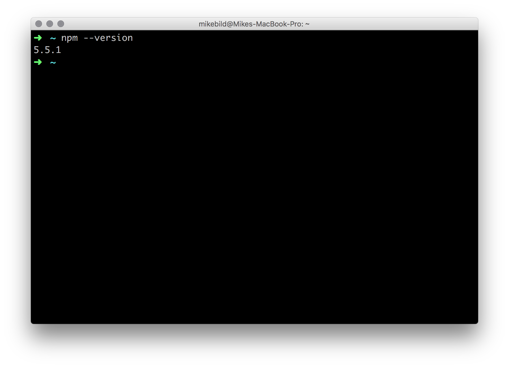
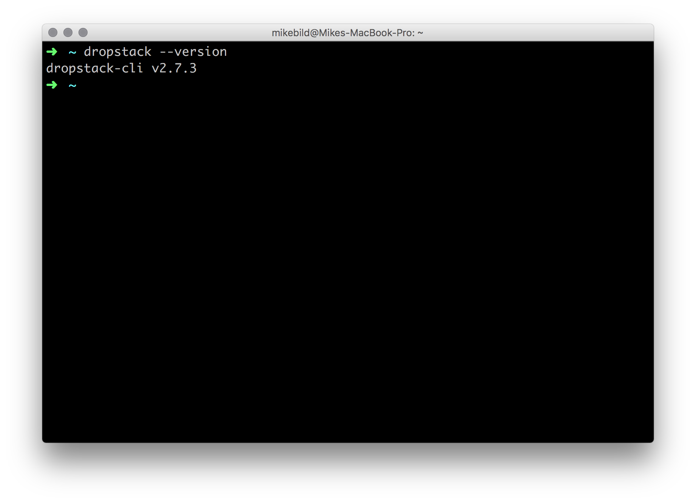
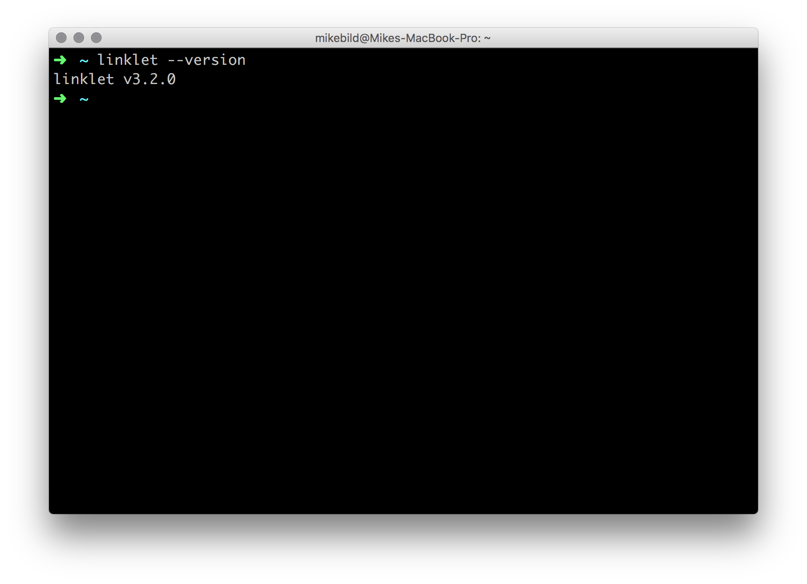
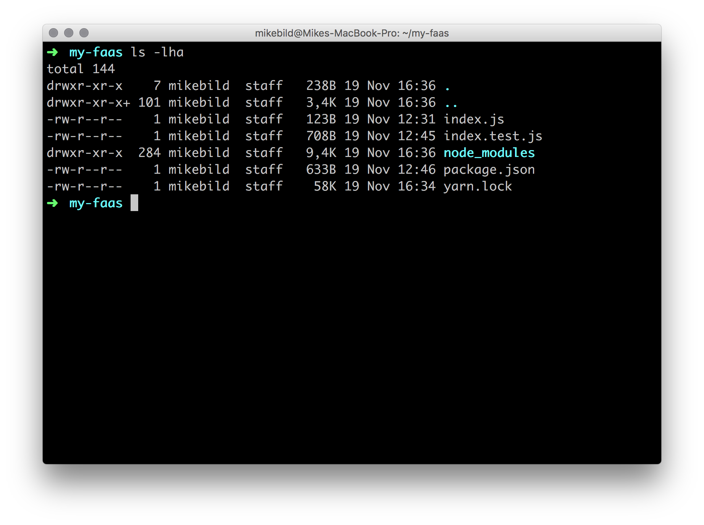
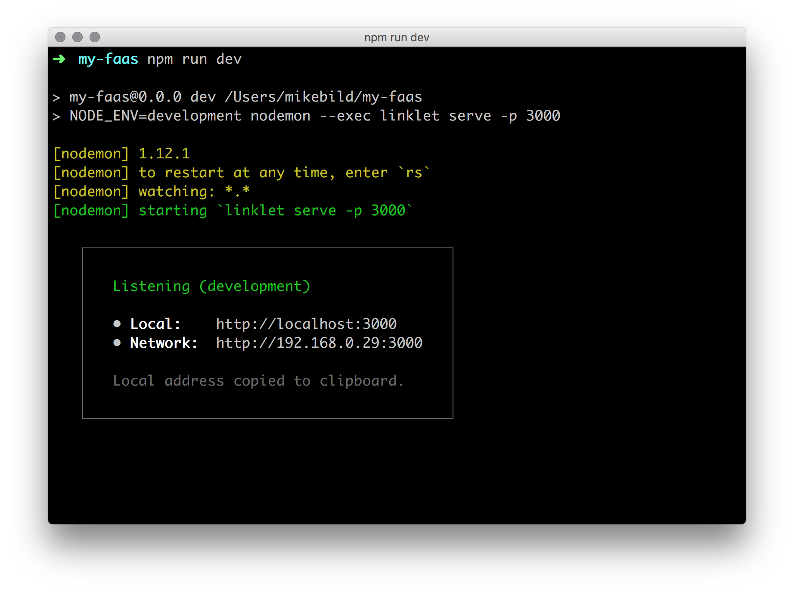
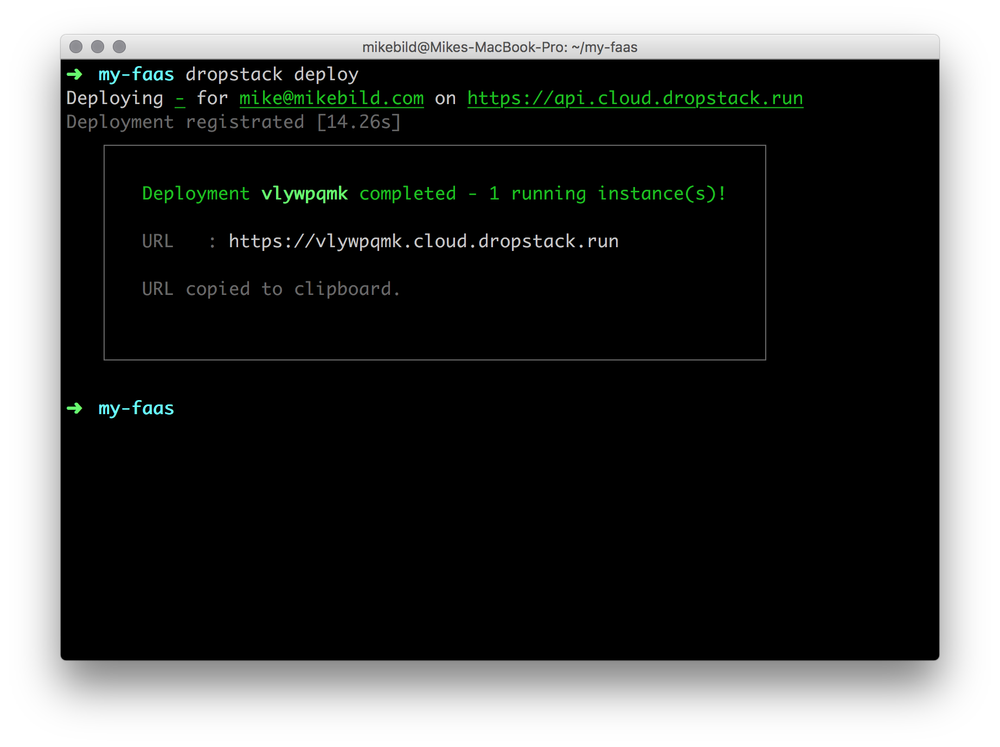
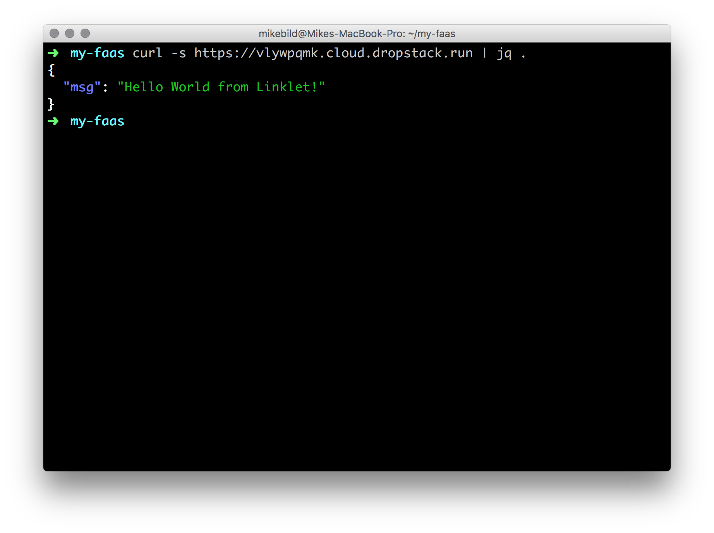
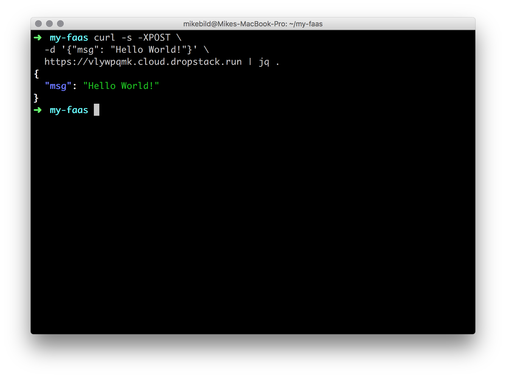

# From Zero to Function-as-a-Service

The following guide will show you how to deploy a simple HTTP micro-service written in JavaScript using [Linklet](https://linklet.run) deployed with [DropStack](https://dropstack.run).

It uses Open Source tools that are widely available, tested and understood:

- NodeJS v8.9.x
- NPM

## Prerequisites

Make sure NodeJS v8.9.x is installed in your machine. If not, head to [https://nodejs.org](https://nodejs.org) and download it and install it.

To make sure NodeJS (which comes with `npm`) is properly installed, run the command:

```bash
npm --version
```

It should look similar to this:



### Installing DropStack

`dropstack` is a tool that will immediately deploy any NodeJS Applications and HTTP service (Stacklets) with all its files and dependencies to a hybrid-cloud environment.

Install it with NPM as follows:

```bash
npm install -g dropstack-cli
```

To verify it's installed and it works run:

```bash
dropstack --version
```

It should look similar to this:



### Installing Linklet CLI

`linklet` is a CLI tool to create a Function-as-a-Service from a micro service skeleton template and allows it to run it locally.

Install it with NPM as follows:

```bash
npm install -g linklet
```

To verify it's installed and it works run:

```bash
linklet --version
```

It should look similar to this:



## Creating your Function-as-a-Service

Create a fresh HTTP service for it and go to it:

```bash
linklet create my-faas
cd ./my-faas
```

If you then look at the content of the folder, it will look as follows:



## Run your Function-as-a-Service

To run your micro-service locally, just enter:

```bash
npm run dev
```

You should see that it's listening on port `3000`:



Let's try your first request to your service using `curl` ([learn more](https://gist.github.com/caspyin/2288960)):

```bash
curl -s http://localhost:3000 | jq .
```

## Deploy your Function-as-a-Service

It's time to deploy your micro-service to the cloud.

```bash
dropstack deploy
```



Done in some seconds! Cool! Try a request to your first micro-service deployment:

```bash
curl -s https://vlywpqmk.cloud.dropstack.run | jq .
```



## Writing your Function-as-a-Service

We'll first write a basic HTTP endpoint that accepts POST requests. In another instance of the terminal,

```bash
vi index.js
```

Adjust you micro-service implementation:

```javascript
const {json} = require('linklet');

module.exports = async req => {
  const data = await json(req);
  return {...data};
};
```

Let's try it locally:

```bash
curl -s -XPOST \
  -d '{"msg": "Hello World!"}' \
  https://localhost:3000 | jq .
```

Redeploy:

```bash
dropstack deploy
```

And let's try again remotely:

```bash
curl -s -XPOST \
  -d '{"msg": "Hello World!"}' \
  https://vlywpqmk.cloud.dropstack.run | jq .
```



Voila! Micro-Services done right. Fast and easy! Isn't it? If you have any questions about this tutorial, please add an issue in this GitHub project.